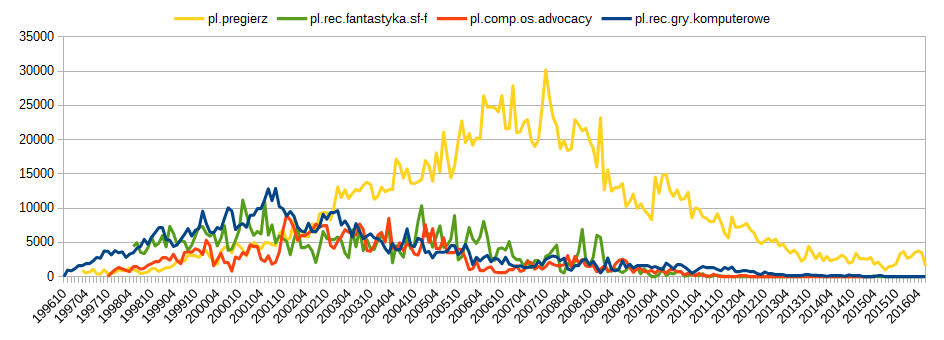
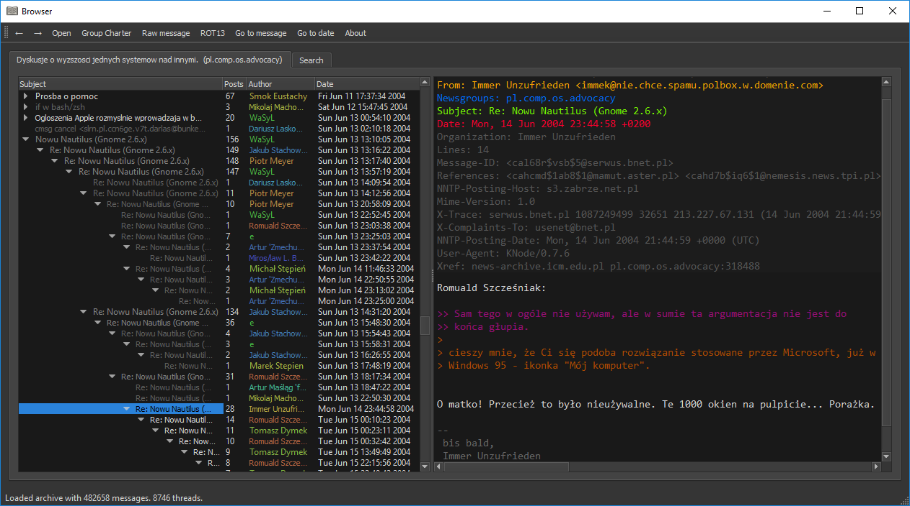
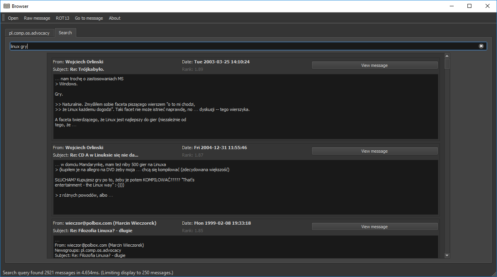
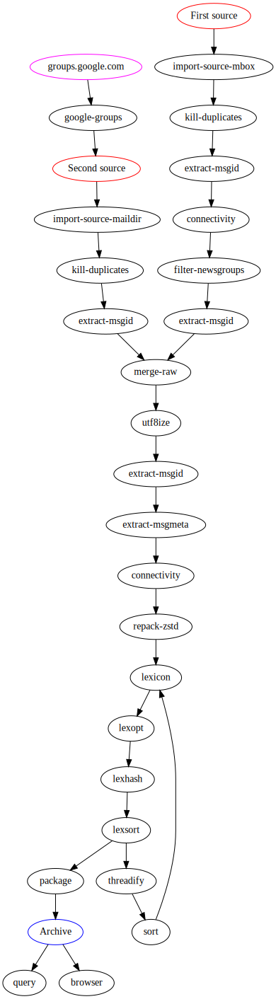

# Usenet Archive Toolkit

Usenet Archive Toolkit project aims to provide a set of tools to process various sources of usenet messages into a coherent, searchable archive.

## Motivation

Usenet is dead. You may believe it's not, but it really is.

People went away to various forums, facebooks and twitters and seem fine there. Meanwhile, the old discussions slowly rot away. Google groups is a sad, unusable joke. Archive.org dataset, at least with regard to polish usenet archives, is vastly incomplete. There is no easy way to get the data, browse it, or search it. So, maybe something needs to be done. How hard can it be anyway?

## Toolkit description

UAT provides a multitude of utilities, each specialized for its own task. You can find a brief description of each one below.

### Import Formats

Usenet messages may be retrieved from a number of different sources. Currently we support:

- import-source-slrnpull --- Import from a directory where each file is a separate message (slrnpull was chosen because of extra-simple setup required to get it working).
- import-source-slrnpull-7z --- Import from a slrnpull directory compressed into a single 7z compressed file.
- import-source-mbox --- [Archive.org](https://archive.org/details/usenet) keeps its collection of usenet messages in a mbox format, in which all posts are merged into a single file.

Imported messages are stored in a per-message LZ4 compressed meta+payload database.

### Data Processing

Raw imported messages have to be processed to be of any use. We provide the following utilities:

- extract-msgid --- Extracts unique identifier of each message and builds reference table for fast access to any message through its ID.
- extract-msgmeta --- Extracts "From" and "Subject" fields, as a quick reference for archive browsers.
- merge-raw --- Merges two imported data sets into one. Does not duplicate messages.
- utf8ize --- Converts messages to a common character encoding, UTF-8.
- connectivity --- Calculate connectivity graph of messages. Also parses "Date" field, as it's required for chronological sorting.
- threadify --- Some messages do not have connectivity data embedded in headers. Eg. it's a common artifact of using news-email gateways. This tool parses top-level messages, looking for quotations, then it searches other messages for these quotes and creates (not restores! it was never there!) missing connectivity between children and parents.
- repack-zstd --- Builds a common dictionary for all messages and recompresses them to a zstd meta+payload+dict database.
- repack-lz4 --- Converts zstd database to LZ4 database.
- package --- Packages all databases into a single file. Supports unpacking.

### Data Filtering

Raw data right after import is highly unfit for direct use. Messages are duplicated, there's spam. These utilities help clean it up:

- kill-duplicates --- Removes duplicate messages. It is relatively rare, but data sets from even a single NNTP server may contain the same message twice.
- filter-newsgroups --- Some data sources (eg. Archive.org's giganews collection) contain messages that were not sent to the collection's newsgroup. This utility will remove such bogus messages.
- filter-spam --- Learns which messages look like spam and removes them.

### Data Search

Search in archive is performed with the help of a word lexicon. The following tools are used for its preparation:

- lexicon --- Build a list of words and hit-tables for each word.
- lexstats --- Display lexicon statistics.
- lexdist --- Calculate distances between words (unused).
- lexhash --- Prepare lexicon hash table.
- lexsort --- Sort lexicon data.

### Data Access

These tools provide access to archive data:

- query-raw --- Implements queries on LZ4 database. Requires results of extract-msgid utility. Supports:
    * Message count.
    * Listing of message identifiers.
    * Query message by identifier.
    * Query message by database record number.
- libuat --- Archive access library. Operates on zstd database.
- query --- Testbed for libuat. Exposes all provided functionality.

### End-user Utilities

- browser --- Graphical browser of archives.

## Workflow

Usenet Archive Toolkit operates on a couple of distinct databases. Each utility requires a specific set of these databases and produces its own database, or creates a completly new database indexing schema, which invalidates rest of databases.

slrnpull directory → **import-source-slrnpull** → produces: *LZ4*  
slrnpull compressed → **import-source-slrnpull-7z** → produces: *LZ4*  
mbox file → **import-source-mbox** → produces: *LZ4*  
*LZ4* → **kill-duplicates** → produces: *LZ4*  
*LZ4* → **extract-msgid** → adds: *msgid*  
*LZ4*, *msgid* → **connectivity** → adds: *conn*  
*LZ4*, *conn* → **filter-newsgroups** → produces: *LZ4*  
*LZ4*, *msgid*, *conn*, *str* → **filter-spam** → produces: *LZ4*  
*LZ4* → **extract-msgmeta** → adds: *str*  
(*LZ4*, *msgid*) + (*LZ4*, *msgid*) → **merge-raw** → produces: *LZ4*  
*LZ4* → **utf8ize** → produces: *LZ4*  
*LZ4* → **repack-zstd** → adds: *zstd*  
*zstd* → **repack-lz4** → adds: *LZ4*  
*LZ4*, *conn* → **lexicon** → adds: *lex*  
*lex* → **lexhash** → adds: *lexhash*  
*lex* → **lexsort** → modifies: *lex*  
*lex* → **lexdist** → adds: *lexdist* (unused)  
*lex* → **lexstats** → user interaction  
*LZ4*, *msgid* → **query-raw** → user interaction  
*zstd*, *msgid*, *conn*, *str*, *lex*, *lexhash* → **libuat** → user interaction  
*everything but LZ4* → **package** → *one file archive*  
*everything but LZ4* → **threadify** → modifies: *conn*, invalidates: *lex*, *lexhash*

Additional, optional information files, not created by any of the above utilities, but used in user-facing programs:

- name --- Group name.
- desc\_short --- A short description about the purpose of the group ([per 7.6.6 in RFC 3977](https://tools.ietf.org/html/rfc3977#section-7.6.6)).
- desc\_long --- Group charter. (*Some newsgroups regularly post a description to the group that describes its intention. These descriptions are posted by the people involved with the newsgroup creation and/or administration. If the group has such a description, it almost always includes the word "charter", so you can quickly find it by searching the newsgroup for that word. A charter is the "set of rules and guidelines" which supposedly govern the users of that group.*)

## Typical Workflow

## Notes

Be advised that some utilities (repack-zstd, lexicon) do require enormous amounts of memory. Processing large groups (eg. 2 million messages, 3 GB data) will swap heavily on a 16 GB machine.

UAT only works on 64 bit machines.

## License

    Usenet Archive
    Copyright (C) 2016  Bartosz Taudul <wolf.pld@gmail.com>

    This program is free software: you can redistribute it and/or modify
    it under the terms of the GNU Affero General Public License as
    published by the Free Software Foundation, either version 3 of the
    License, or (at your option) any later version.

    This program is distributed in the hope that it will be useful,
    but WITHOUT ANY WARRANTY; without even the implied warranty of
    MERCHANTABILITY or FITNESS FOR A PARTICULAR PURPOSE.  See the
    GNU Affero General Public License for more details.

    You should have received a copy of the GNU Affero General Public License
    along with this program.  If not, see <http://www.gnu.org/licenses/>.
